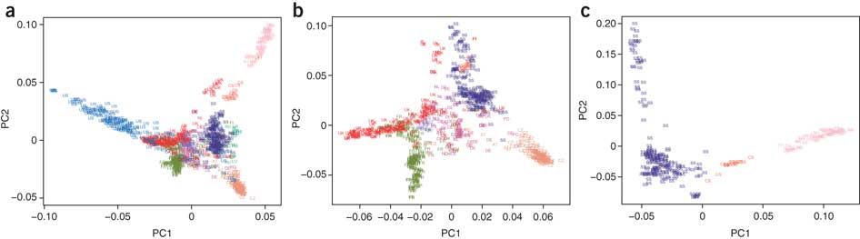

```{r setup, include=FALSE}
source("sim-data-fns.R")
require(pander)
panderOptions("table.split.table",150)
```

# Principal Components Analysis (PCA) | and visualization

## Goal: a low-dimensional summary.

The first step to data analysis:
*look at the data*.

How to look at millions of loci (/variables/dimensions)?

. . .

(*keyword*: "dimensionality reduction")


##

*Genes mirror geography within Europe*, Novembre et al 2008
<a href="http://www.nature.com/nature/journal/v456/n7218/full/nature07331.html"></a>

## 

Genome-wide patterns of genetic variation in worldwide Arabidopsis thaliana accessions from the RegMap panel, Horton et al 2012
<a href="http://www.nature.com/ng/journal/v44/n2/full/ng.1042.html"></a>

##

*Genomic divergence in a ring species complex*, Alcaide et al 2014
<a href="http://www.nature.com/nature/journal/v511/n7507/full/nature13285.html"></a>

## How to do it

Your data:

```{r sim_data, echo=FALSE}
simdata <- sim_data(nind=5,nloci=12)
pander(t(simdata$alleles))
```


## First step: change letters to numbers.

Translate alleles to "number of reference alleles":

```{r numeric_data, echo=FALSE}
pander(t(simdata$genotypes))
```

*note:* the choice of "reference" allele won't matter.

## Words about PCA

        -   direction of maximum variation: weights on alleles
        -   decomposition of variance
        -   matrix decompositions
        -   spatial structure and Fourier modes

## Technical issues

        -   normalization
        -   weighting and sample sizes
        -   correlated markers

# Doing PCA: hands-on

## Three populations, simulated

        -   computing the covariance matrix
        -   PCA

## POPRES (as in http://www.ncbi.nlm.nih.gov/pubmed/18758442)

        -   covariance matrix provided
        -   downweighting populations
        -   subsets of the genome


# Continuous geography

## Nearby things are more similar than distant ones

        -   ... because they are more closely related.
        -   Migration, coalescence, covariance, and genetic distance.

## Isolation by distance/environment/ecology/etcetera

        -   resistance distance

## Phenomenological model: correlated allele frequencies

# Using BEDASSLE

## BEDASSLE's parameterization

## Lightning introduction to MCMC

        -   acceptance rates
        -   likelihood profile
        -   mixing and stationarity

## Simulated data

