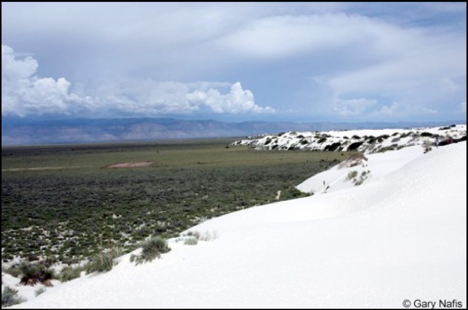

<style>
.footer {
    color: black;
    background: #E8E8E8;
    position: fixed;
    top: 90%;
    text-align:center;
    width:100%;
}
</style>

```{r setup, include=FALSE}
source("sim-data-fns.R")
require(pander)
panderOptions("table.split.table",150)
```

# Principal Components Analysis (PCA) | and visualization

## Goal: a low-dimensional summary.

The first step to data analysis:
*look at the data*.

How to look at millions of loci (/variables/dimensions)?

. . .

(*keyword*: "dimensionality reduction")


1. examples from the literature
2. how to do it: overview
3. properties of PCA
4. how to do it: hands-on

##
*Genes mirror geography within Europe*, Novembre et al 2008
<a href="http://www.nature.com/nature/journal/v456/n7218/full/nature07331.html"></a>

##
*New insights into the Tyrolean Iceman's origin and phenotype as inferred by whole-genome sequencing*, Keller et al 2011
<a href="http://www.nature.com/ncomms/journal/v3/n2/full/ncomms1701.html"></a>

##
*Genomic divergence in a ring species complex*, Alcaide et al 2014
<a href="http://www.nature.com/nature/journal/v511/n7507/full/nature13285.html"></a>

<!--

## 
*Origins and Genetic Legacy of Neolithic Farmers and Hunter-Gatherers in Europe*,  Skoglund et al 2012
<a href="http://www.sciencemag.org/content/336/6080/466.long"></a>

## 
Genome-wide patterns of genetic variation in worldwide Arabidopsis thaliana accessions from the RegMap panel, Horton et al 2012
<a href="http://www.nature.com/ng/journal/v44/n2/full/ng.1042.html"></a>
<a href="http://www.nature.com/ng/journal/v44/n2/full/ng.1042.html"></a>
-->


## Anatomy of PCA

Your data:

```{r sim_small_data, echo=FALSE}
simdata <- sim_data(nind=5,nloci=12)
pander(t(simdata$alleles))
```


## First: change letters to numbers.

Translate alleles to "number of reference alleles":

```{r numeric_data, echo=FALSE}
pander(t(simdata$genotypes))
```

*note:* arbitrary choice of "reference" allele.


## Second: compute a similarity matrix

Default choice:

0.  Trim tightly linked loci (e.g. with [plink](http://pngu.mgh.harvard.edu/~purcell/plink/))

    - avoid influence of large linked blocks

1.  Subtract locus means ($2 \times{}$ allele frequencies)

    - makes result independent of reference allele choices

2.  Estimate covariance between individuals

    - methods available for missing data


## Second: compute a similarity matrix

```{r covmat, echo=FALSE}
covmat <- crossprod(sweep(simdata$genotypes,1,rowMeans(simdata$genotypes),"-"))
pander(covmat)
```


## Third: eigendecomposition

```{r eigen_ex, echo=1}
pca <- eigen(covmat)
names(pca$values) <- colnames(pca$vectors) <- paste("PC",1:ncol(pca$vectors),sep="")
rownames(pca$vectors) <- rownames(covmat)
```

Eigenvalues:

 :  proportion of variance explained

```{r eigen_ex_values, echo=TRUE}
pca$values/sum(pca$values)
```


Eigenvectors:

 :  the positions of the samples on the **principal components**

```{r eigen_ex_vectors, echo=TRUE}
pca$vectors
```

## Fourth: making pretty pictures

The eigenvectors are the *coordinates* of the samples on the *principal components*:
so just plot them against each other:

```{r eigen_ex_plot, echo=TRUE}
pairs( pca$vectors[,1:3] )
```


## Questions to which PCA gives the answer:

(@)   direction of maximum variation: weights on alleles
(@)   decomposition of variance
(@)   matrix decompositions
(@)   spatial structure and Fourier modes

"axes that explain most of the variance"

## Technical issues

**Normalization:** 

 :  you can choose to upweight low frequency alleles (e.g. divide by $1/\sqrt{p(1-p)}$);
    this may or may not make a difference.

**Sample sizes:** 

 :  if the sampling scheme is unbalanced, the top PCs may choose to explain the variance *within* the most heavily sampled population,
    rather than variation between populations. 

    *Solution:* downweight by sample size.

**Linkage:** 

 :  large linkage blocks (e.g. inversions) can hijack the top PCs.

    *Solution:* prune linked SNPs.


# Doing PCA: demonstrated

## Simulated data:

```{r sim_data, cache=TRUE}
nind <- 1000
nloci <- 1e4
simdata <- sim_data(nind=nind,nloci=nloci)
cols <- rainbow(nind)[rank(simdata$locs[,1])]
pchs <- as.numeric(cut(simdata$locs[,2],breaks=12))
plot( simdata$locs, col=cols, pch=pchs, main="sampling scheme" )
```

## PCA on simulated data:

```{r sim_pca, cache=TRUE, depends="sim_data"}
norm.genotypes <- sweep( simdata$genotypes, 1, rowMeans(simdata$genotypes), "-" )
covmat <- cov(norm.genotypes)
pca <- eigen(covmat)
plot(pca$values/sum(pca$values),ylab="proportion", main="proportion of variance explained", xlab="PC#")
```

## PCA map:

```{r plot_sim_pca_map}
layout(t(1:2))
plot(simdata$locs, col=cols, pch=pchs, main="locations" )
plot(pca$vectors[,1:2], col=cols, pch=pchs, main="PC map", xlab="PC1", ylab="PC2" )
```

## More PCs:

```{r plot_sim_pca}
pairs(pca$vectors[,1:5], col=cols, pch=pchs )
```

## PCs on the map:

The PCs here are Fourier modes; so the PC plots are like [Lissajous figures](http://en.wikipedia.org/wiki/Lissajous_curve)
(discussion in [Novembre & Stephens](http://www.nature.com/ng/journal/v40/n5/abs/ng.139.html)).

```{r plot_map_pca, echo=FALSE}
layout(matrix(1:9,nrow=3))
par(mar=c(2,2,3,1)+.1)
for (k in 1:9) {
    plot( simdata$locs, col=heat.colors(64)[cut(pca$vectors[,k],breaks=64)], main=paste("PC",k,sep='') )
}
```


# Doing PCA: hands-on


## Your turn: the POPRES

Same data as in [Genes mirror geography within Europe](http://www.nature.com/nature/journal/v456/n7218/full/nature07331.html),
but without subsetting:

- `popres/crossprod_all-covariance.tsv` : covariance matrix *without* subtracting allele means
- `popres/crossprod_chr8-covariance.tsv` : covariance matrix *without* subtracting allele means
- `popres/indivinfo.tsv` : sample information
- `source(popres/indivinfo.R)` : for country abbreviations and colors

Your tasks:

1.  Renormalize the covariance matrix.
2.  Find the eigendecomposition.
3.  What proportion of variance is explained by each PC?
4.  Plot the first two PCs against each other.
5.  Subsample to obtain more even sampling.


# Continuous geography

## Not all populations look like this

<a href="http://en.wikipedia.org/wiki/Macquarie_Island"></a>
<!--  -->
[*wikipedia:M. Murphy*](http://en.wikipedia.org/wiki/Macquarie_Island#/media/File:RoyalPenguins4.JPG)


## Continuous space

> Everything is related to everything else, but near things are more related than distant things. 

*Waldo Tobler, 1970*

**Why?**  
Offspring tend to live near to their parents, and so neighbors tend to 

-  be more closely related,
-  i.e. have fewer generations separting them from their common ancestors,
-  i.e. have more similar genomes.


## "Isolation by distance" | correlation of genetic and geographic distances


From a *population* viewpoint, local drift differentiates populations,
while migration makes nearby ones more similar.

From the *individual* viewpoint, 
lower population sizes means more recent, nearby shared ancestors;
a tendency counteracted by migration.


## Isolation by distance


<!--  -->

## Isolation by distance, environment


<!--  -->


## Isolation by *


<!--  -->
[Wang & Bradburd](http://onlinelibrary.wiley.com/doi/10.1111/mec.12938/abstract)


## Motivating example {.columns-2}



[*Des Roches et al 2013*](http://onlinelibrary.wiley.com/doi/10.1111/bij.12165/full)


## Phenomenological model: correlated allele frequencies

## Cartoon model

-  Sample some alleles at two locations, $x$ and $y$,
-  which descend from some ancestors a long time ago.
-  Each ancestor's genotype was chosen independently, with frequency $f$;
-  samples sharing the same ancestor have the same allele;
-  so the modern frequency is near $f$, but has drifted.
-  Nearby samples are more likely to share a recent common ancestor,
-  so the allele frequencies at $x$ and $y$ are *correlated*
-  with a strength that depends on their distance apart.


## Gestalt model

-  The *allele frequency* at locus $\ell$ in population $k$ is
    $$f_{\ell k} = \text{( global mean )} + \text{( spatially autocorrelated noise )}$$

-  and it would be nice if the noise was Gaussian.

-  The sampled alleles are independent${}^*$ draws from these frequencies.

**But:** need to trasnform from $(-\infty,\infty)$ (Gaussians) to $[0,1]$ (frequencies).


${}^*$ *actually, Beta-Binomial, to allow for population-specific inbreeding coefficients.*


## Mathematical model

-  The *allele frequency* at locus $\ell$ in population $k$ is
    $$f_{\ell k} = \frac{1}{1+e^{-(\Theta_{\ell k}+\mu_\ell)}}$$

-  where $\mu_\ell$ is the (transformed) global mean allele frequency

-  and $\Theta$ are multivariate Gaussian deviations
   $$\Theta_{\ell k} \sim N(0,\Omega)$$

-  with covariance matrix $\Omega_{}$.


# Using BEDASSLE

## BEDASSLE's model

With 
$$ D_{i,j} = \text{(geographic distance between samples $i$ and $j$)} $$
and
$$ E_{i,j} = \text{(environmental distance between samples $i$ and $j$)} $$

we use the flexible parametric form
$$ \Omega_{i,j} = \frac{1}{\alpha_0} e^{-(\sqrt{ \alpha_D D_{ij}^2 + \alpha_E E_{ij}^2 })^\alpha_2 } .$$


## and call it

<div style="font-size: 200%;">
    <span style="color:black; font-weight:bold;">B</span>ayesian <br/>
    <span style="color:red; font-weight:bold;">E</span>stimation of  <br/>
    <span style="color:orange; font-weight:bold;">D</span>ifferentiation in <br/>
    <span style="color:yellow; font-weight:bold;">A</span>lleles by <br/>
    <span style="color:green; font-weight:bold;">S</span>patial <br/>
    <span style="color:blue; font-weight:bold;">S</span>tructure and <br/>
    <span style="color:violet; font-weight:bold;">L</span>ocal <br/>
    <span style="color:black; font-weight:bold;">E</span>cology
</div>

[Bradburd, Ralph & Coop 2013, *Evolution*](onlinelibrary.wiley.com/doi/10.1111/evo.12193)

## a.k.a.

<a href="http://genescape.ucdavis.edu/scripts-and-code/bedassle/">

</a>

## Lightning introduction to MCMC

    -   acceptance rates
    -   likelihood profile
    -   mixing and stationarity

## Simulated data

```{r sim_ibde_data, echo=1:4, cache=TRUE}
nind <- 50; nloci <- 1000
locs <- data.frame( lat=runif(nind), lon=runif(nind) )
env <- ifelse( locs$lat>0.5, 1, 0 )
sim <- sim_data(nind=nind,nloci=nloci,locs=locs,env=env,aE=2)
layout(matrix(1:6,nrow=2))
par(mar=c(2,2,2,1)+.1)
plot(locs, col=1+env, pch=20, main='locations')
for (k in sample.int(nloci,5)) {
    plot( locs, col=c("blue","purple","red")[1+sim$genotypes[k,]], pch=20, main=paste("locus",k) )
}
```

## Simulated data: IBDE

```{r show_ibde, echo=1:7}
covmat <- cov(sweep(sim$genotypes,1,rowMeans(sim$genotypes),"-"))
D <- sqrt( outer( sim$locs[,1], sim$locs[,1], "-" )^2 + outer( sim$locs[,2], sim$locs[,2], "-" )^2 )
E <- abs( outer( sim$env, sim$env, "-" ) )
genetic.dist <- matrix(NA,nrow=nind,ncol=nind)
for (i in 1:nind) for (j in i:nind) {
    genetic.dist[i,j] <- genetic.dist[j,i] <- sqrt(mean((sim$genotypes[,i]-sim$genotypes[,j])^2))
}
cols <- rainbow(16,start=4/6,end=0)
ut <- upper.tri(D)
ecols <- adjustcolor(cols,.5)[cut(E[ut],breaks=16)]
layout(t(1:2))
plot( D[ut], covmat[ut], col=ecols, main="covariance", pch=20, ylab='' )
plot( D[ut], genetic.dist[ut], col=ecols, main="genetic distance", pch=20, ylab='' )
```

## PCA on IBDE

```{r pca_on_ibde, echo=-1}
labels <- order(order(cut(locs[,1],breaks=5),(locs[,2])))
tplot <- function (xy,col=1,...) { plot(xy,type='n',...); text(xy,labels=labels,col=col) }
pca <- eigen(covmat)

layout(t(1:2))
tplot( locs, main="location", col=1+E )
tplot( pca$vectors[,1:2], xlab="PC1", ylab="PC2", main="PC map", col=1+E )
```

## PCA on IBDE

```{r pca_on_ibde_maps, echo=-1}
layout(t(1:2))
tplot( locs, col=cols[cut(pca$vectors[,1],16)], pch=20, main="PC1" ); abline(v=0.5)
tplot( locs, col=cols[cut(pca$vectors[,2],16)], pch=20, main="PC2" ); abline(v=0.5)
```


# Running BEDASSLE

```{r bedassle_run, cache=TRUE, depends="sim_ibde_data"}
	require(BEDASSLE)
	
	#Initiate the MCMC analysis
	MCMC_run <- MCMC(	
            counts = t(sim$genotypes),
			sample_sizes = matrix(2,nrow=nind,ncol=nloci),
			D = D,  # geographic distances
            E = E,  # environmental distances
			k = nind, loci = nloci,  # dimensions of the data
			delta = 0.0001,  # a small, positive, number
			aD_stp = 0.01,   # step sizes for the MCMC
			aE_stp = 0.01,
			a2_stp = 0.025,
			thetas_stp = 0.2,
			mu_stp = 0.35,
			ngen = 100, 		# number of steps (2e6)
			printfreq = 10,		# print progress (1000)
			savefreq = 2e5,     # save out current state
			samplefreq = 5,		# record current state for posterior (2000)
			prefix = "CGW_1",   # filename prefix
			continue=FALSE,
			continuing.params=NULL)
```


## Summary and wrap-up

**PCA:**

1.  Great for quick visualization,
2.  but beware of over-interpretation,
3.  as minor details are not stable, and major details might not be either.


# Technical appendices

## Trim linked SNPs and recode as numeric

Using [plink](http://pngu.mgh.harvard.edu/~purcell/plink/):

```
# Trim down to pairwise r2 no more than 0.25:
plink --file $INFILE --indep-pairwise 50 5 0.25 --out $INFILE_prunesnps
# Turn result to numeric matrix
plink --file $INFILE --extract $INFILE_prunesnps.prune.in --recodeA --out $INFILE_pruned
```

## Estimate covariance matrix with R

In the presence of missing data:

```{r example, eval=FALSE}
cov(genotypes,use="pairwise.complete.obs")
```

