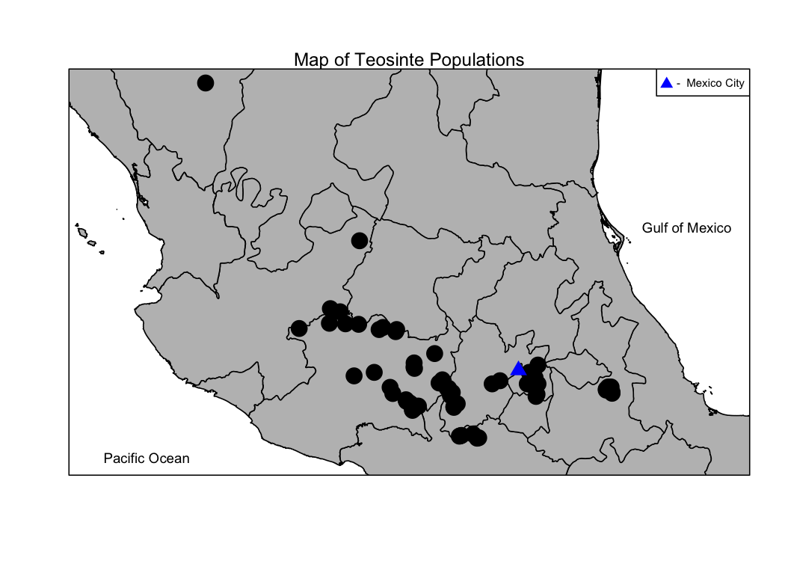
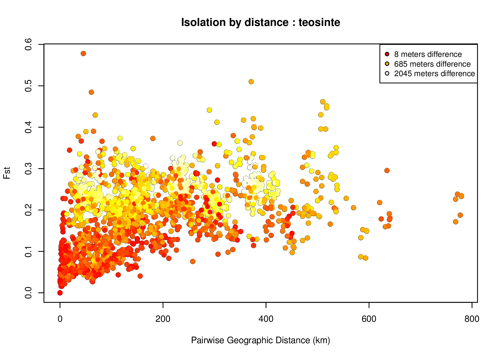
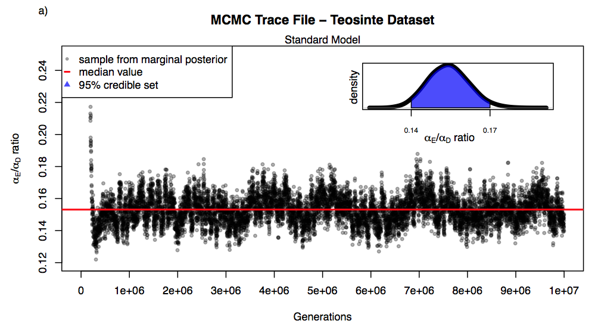

<style>
.footer {
    color: black;
    background: #E8E8E8;
    position: fixed;
    top: 90%;
    text-align:center;
    width:100%;
}
</style>

```{r setup, include=FALSE}
source("sim-data-fns.R")
require(pander)
panderOptions("table.split.table",150)
```

# Principal Components Analysis (PCA) | and visualization

## Goal: a low-dimensional summary.

The first step to data analysis:
*look at the data*.

How to look at millions of loci (/variables/dimensions)?


(*keyword*: "dimensionality reduction")


**Overview:**

1. examples from the literature
2. how to do it: overview
3. properties of PCA
4. how to do it: hands-on

##
*Genes mirror geography within Europe*, Novembre et al 2008
<a href="http://www.nature.com/nature/journal/v456/n7218/full/nature07331.html"></a>

##
*New insights into the Tyrolean Iceman's origin and phenotype as inferred by whole-genome sequencing*, Keller et al 2011
<a href="http://www.nature.com/ncomms/journal/v3/n2/full/ncomms1701.html"></a>

##
*Genomic divergence in a ring species complex*, Alcaide et al 2014
<a href="http://www.nature.com/nature/journal/v511/n7507/full/nature13285.html"></a>

<!--

## 
*Origins and Genetic Legacy of Neolithic Farmers and Hunter-Gatherers in Europe*,  Skoglund et al 2012
<a href="http://www.sciencemag.org/content/336/6080/466.long"></a>

## 
Genome-wide patterns of genetic variation in worldwide Arabidopsis thaliana accessions from the RegMap panel, Horton et al 2012
<a href="http://www.nature.com/ng/journal/v44/n2/full/ng.1042.html"></a>
<a href="http://www.nature.com/ng/journal/v44/n2/full/ng.1042.html"></a>
-->


## Anatomy of PCA

Your data:

```{r sim_small_data, echo=FALSE}
simdata <- sim_data(nind=5,nloci=12)
pander(t(simdata$alleles))
```


## First: change letters to numbers.

Translate alleles to "proportion of reference alleles":

```{r numeric_data, echo=FALSE}
pander(t(simdata$genotypes)/2)
```

*note:* arbitrary choice of "reference" allele.


## Second: compute a similarity matrix

Default choice:

0.  Trim tightly linked loci (e.g. with [plink](http://pngu.mgh.harvard.edu/~purcell/plink/))

    - reduces influence of large linked blocks

1.  Subtract locus means ($2 \times{}$ allele frequencies)

    - makes result independent of reference allele choices

2.  Estimate covariance between individuals

    - methods available for missing data


## Second: compute a similarity matrix

e.g. the **covariance matrix**, 
obtained by `cov(x, use='pairwise.complete.obs')` in `R`:
```{r covmat, echo=1}
covmat <- cov(sweep(simdata$genotypes,1,rowMeans(simdata$genotypes),"-"))
pander(covmat)
```

*note:* you can apply this to any similarity matrix;
we'll assume we're using the covariance matrix.


## Third: eigendecomposition

```{r eigen_ex, echo=1}
pca <- eigen(covmat)
names(pca$values) <- colnames(pca$vectors) <- paste("PC",1:ncol(pca$vectors),sep="")
rownames(pca$vectors) <- rownames(covmat)
```

Eigenvalues:

 :  proportion of variance explained

```{r eigen_ex_values, echo=TRUE}
pca$values/sum(pca$values)
```


Eigenvectors:

 :  the positions of the samples on the **principal components**

```{r eigen_ex_vectors, echo=TRUE}
pca$vectors
```

## Fourth: making pretty pictures

The eigenvectors are the *coordinates* of the samples on the *principal components*:
so just plot them against each other:

```{r eigen_ex_plot, echo=TRUE}
pairs( pca$vectors[,1:3] )
```


## Properties of PCA: math

> *"The principal components are the axes that explain the most variance."*

Technically, this means that the top $k$ PCs 
give the best $k$-dimensional approximation
to the simliarity matrix: with eigenvalues $\lambda_i$,
eigenvectors $v_i$, and similiarity matrix $\Sigma$:

$\Sigma \approx \sum_{i=1}^k \lambda_i v_i v_i^T$

More is true: if $\tilde G$ is the matrix of genotypes,
with row and column means subtracted off,
then there are vectors of *allele weights* $w_i$
so that

$\tilde G \approx \sum_{i=1}^k \sqrt{\lambda_i} w_i v_i^T .$

Another consequence: the PCs can be expressed as weighted sums of the genotypes.
(**so:** admixed individuals show up intermediate to parentals)


## Technical issues

**Normalization:** 

 :  you can choose to upweight low frequency alleles (e.g. divide by $1/\sqrt{p(1-p)}$);
    this may or may not make a difference.

**Linkage:** 

 :  large linkage blocks (e.g. inversions) can hijack the top PCs.

    *Solution:* prune linked SNPs.

**Sample sizes:** 

 :  if the sampling scheme is unbalanced, the top PCs may choose to explain the variance *within* the most heavily sampled population,
    rather than variation between populations. 

    *Solution:* downweight by sample size:
    ```{r ex_weights, eval=FALSE}
    weighted.covmat <- covmat * weights[col(covmat)] * weights[row(covmat)]
    eigen(weighted.covmat)
    ```


# Doing PCA: demonstrated

## Simulated data:

```{r sim_data, cache=TRUE, echo=-(4:5)}
nind <- 1000
nloci <- 1e4
simdata <- sim_data(nind=nind,nloci=nloci)
cols <- rainbow(nind)[rank(simdata$locs[,1])]
pchs <- as.numeric(cut(simdata$locs[,2],breaks=12))
plot( simdata$locs, col=cols, pch=pchs, main="sampling scheme" )
```

## PCA on simulated data:

```{r sim_pca, cache=TRUE, depends="sim_data"}
norm.genotypes <- sweep( simdata$genotypes, 1, rowMeans(simdata$genotypes), "-" )
covmat <- cov(norm.genotypes)
pca <- eigen(covmat)
plot(pca$values/sum(pca$values),ylab="proportion", main="proportion of variance explained", xlab="PC#")
```

## PCA map:

```{r plot_sim_pca_map}
layout(t(1:2))
plot(simdata$locs, col=cols, pch=pchs, main="locations" )
plot(pca$vectors[,1:2], col=cols, pch=pchs, main="PC map", xlab="PC1", ylab="PC2" )
```

## More PCs:

```{r plot_sim_pca}
pairs(pca$vectors[,1:5], col=cols, pch=pchs )
```

## PCs on the map:

The PCs here are Fourier modes; so the PC plots are like [Lissajous figures](http://en.wikipedia.org/wiki/Lissajous_curve)
(discussion in [Novembre & Stephens](http://www.nature.com/ng/journal/v40/n5/abs/ng.139.html)).

```{r plot_map_pca, echo=FALSE}
layout(matrix(1:9,nrow=3))
par(mar=c(2,2,2,0.5)+.1)
for (k in 1:9) {
    plot( simdata$locs, col=heat.colors(64)[cut(pca$vectors[,k],breaks=64)], main=paste("PC",k,sep='') )
}
```


# Doing PCA: hands-on


## Your turn: the POPRES

Same data as in [Genes mirror geography within Europe](http://www.nature.com/nature/journal/v456/n7218/full/nature07331.html),
but without subsetting:

- `popres/crossprod_all-covariance.tsv` : covariance matrix for all chromosomes
- `popres/crossprod_chr8-covariance.tsv` : covariance matrix for just chromosome 8
- `popres/indivinfo.tsv` : sample information
- `source(popres/indivinfo.R)` : for country abbreviations and colors

Your tasks:

<!--  1.  Renormalize the covariance matrix. -->
2.  Find the eigendecomposition.
3.  What proportion of variance is explained by each PC?
4.  Plot the first two PCs against each other.
5.  Do the same thing after subsampling to even out number of samples from each country.
6.  If there's time, look at chromosome 8.


# Continuous geography

## Not all populations look like this

<a href="http://en.wikipedia.org/wiki/Macquarie_Island"></a>
<!--  -->

[*wikipedia:M. Murphy*](http://en.wikipedia.org/wiki/Macquarie_Island#/media/File:RoyalPenguins4.JPG)


## Continuous space {.columns-2}

> Everything is related to everything else, but near things are more related than distant things. 

*Waldo Tobler, 1970*

**Why?**  
Offspring tend to live near to their parents, and so neighbors tend to 

-  be more closely related,
-  i.e. have fewer generations separting them from their common ancestors,
-  i.e. have more similar genomes.


## "Isolation by distance" | correlation of genetic and geographic distances


From a *population* viewpoint, local drift differentiates populations,
while migration makes nearby ones more similar.

From the *individual* viewpoint, 
lower population sizes means more recent, nearby shared ancestors;
a tendency counteracted by migration.


## Isolation by distance


<!--  -->

## Isolation by distance, environment


<!--  -->


## Isolation by *


<!--  -->

[Wang & Bradburd](http://onlinelibrary.wiley.com/doi/10.1111/mec.12938/abstract)


## To study IBE we must account for IBD {.columns-2}


[*Des Roches et al 2013*](http://onlinelibrary.wiley.com/doi/10.1111/bij.12165/full)


## Cartoon model

-  Sample some alleles at two locations, $x$ and $y$,
-  which descend from some ancestors a long time ago.
-  Each ancestor's genotype was chosen independently, with frequency $f$;
-  samples sharing the same ancestor have the same allele;
-  so the modern frequency is near $f$, but has drifted.
-  Nearby samples are more likely to share a recent common ancestor,
-  so the allele frequencies at $x$ and $y$ are *correlated*
-  with a strength that depends on their distance apart.


## Aside on correlated Gaussians

Multivariate Gaussian:

 :  A vector $(X_1,\ldots,X_n)$ is *multivariate Gaussian* with covariance matrix $(\Sigma_{ij})_{i,j=1}^n$
    if any linear combination $a_1 X_1 + \cdots a_n X_n$ is Gaussian with 
    variance $\sum_{ij} a_i \Sigma_{ij} a_j$.

Gaussian process:

 :  A random function $X$ on a region is a *Gaussian process* with covariance function $\sigma(s,t)$
    if for each collection of locations
    $t_1, \ldots, t_n$, the vector $(X(t_1), \ldots, X(t_n))$ is multivariate Gaussian with covariance matrix
    $\Sigma_{ij} = \sigma(t_i,t_j)$.

**This means:** a continuous-space model of correlated allele frequencies
reduces to a covariance matrix.

## Simulated Gaussian field

```{r ex_gaussian_field, cache=TRUE, echo=1:6}
covfn <- function (s,t) { exp(-sqrt(sum((s-t)^2))) }
st <- expand.grid( s=(0:30)/30, t=(0:30)/30 )
covmat <- diag(nrow(st))
for (i in 1:(nrow(st)-1))  for (j in (i+1):nrow(st)) {
    covmat[i,j] <- covmat[j,i] <- covfn(st[i,],st[j,])
}
X <- MASS::mvrnorm(n=1,mu=rep(0,nrow(st)),Sigma=covmat)
dim(X) <- c(31,31)
Matrix::image(Matrix::Matrix(X))
```

## Gestalt model

-  The *allele frequency* at locus $\ell$ in population $k$ is
    $$f_{\ell k} = \text{( global mean )} + \text{( spatially autocorrelated noise )}$$

-  and it would be nice if the noise was Gaussian.

-  The sampled alleles are independent${}^*$ draws from these frequencies.

**But:** need to transform from $(-\infty,\infty)$ (Gaussians) to $[0,1]$ (frequencies).


${}^*$ *actually, Beta-Binomial, to allow for population-specific inbreeding coefficients.*


## Mathematical model

-  The *allele frequency* at locus $\ell$ in population $k$ is

    $f_{\ell k} = \frac{1}{1+e^{-(\Theta_{\ell k}+\mu_\ell)}}$

-  where $\mu_\ell$ is the (transformed) global mean allele frequency

-  and $\Theta$ are multivariate Gaussian deviations

   $\Theta_{\ell k} \sim N(0,\Omega)$

-  with covariance matrix $\Omega_{}$.


## A parametric model:

With 

$D_{i,j} = \text{(geographic distance between samples *i* and *j*)}$

and

$E_{i,j} = \text{(environmental distance between samples *i* and *j*)}$

we use the flexible parametric form

$\Omega_{i,j} = \frac{1}{\alpha_0} \exp\left\{-\left(\sqrt{ \alpha_D D_{ij}^2 + \alpha_E E_{ij}^2 }\right)^{\alpha_2} \right\}.$


## we call this model

<div style="font-size: 200%;">
<span style="color:black; font-weight:bold;">B</span>ayesian <br/>
<span style="color:red; font-weight:bold;">E</span>stimation of  <br/>
<span style="color:orange; font-weight:bold;">D</span>ifferentiation in <br/>
<span style="color:yellow; font-weight:bold;">A</span>lleles by <br/>
<span style="color:green; font-weight:bold;">S</span>patial <br/>
<span style="color:blue; font-weight:bold;">S</span>tructure and <br/>
<span style="color:violet; font-weight:bold;">L</span>ocal <br/>
<span style="color:black; font-weight:bold;">E</span>cology
</div>

[Bradburd, Ralph & Coop 2013, *Evolution*](onlinelibrary.wiley.com/doi/10.1111/evo.12193)

## a.k.a.

<a href="http://genescape.ucdavis.edu/scripts-and-code/bedassle/">

</a>


# Using BEDASSLE


## Method mechanics: input

1.  Sampled populations (*or* individuals)
2.  Data at sampled locations:
    - lat/long, eco/enviro data
3.  Genetic data (numerically coded, as above)


## Recap of model, and analysis goal

-  Populations covary in their allele frequencies.

-  Extent of covariance depends on the distances between them, geographic and ecological.

-  We want to find the relative contribution of these distances.

The main focus is to infer $\alpha_E/\alpha_D$.

We do this by putting priors on the parameters,
and finding the posterior with MCMC.

- $\alpha_D$ : contribution of geographic distance
- $\alpha_{E,i}$ : contribution of eco/enviromental distance $i$
- $\alpha_0$, $\alpha_2$ : scaling parameters
- $\Phi_k$ : population-specific "inbreeding coefficients"
- $\mu_\ell$, $\Theta_{k,\ell}$ : allele-specific transformed frequencies


## Lightning introduction to MCMC

**Markov chain Monte Carlo** is a class of algorithms for *parameter inference*:
as applied here,

**given**

1.  some data
2.  a generative model of that data (with a computable likelihood function)
3.  prior distributions on the parameters of that model

it **finds**

1. samples from the posterior distribution on the parameters
2. which lets you estimate the posterior distribution.

Reminder:

$\mathbb{P}(\text{parameters}\,|\,\text{data}) \propto \mathbb{P}(\text{parameters}) \mathbb{P}(\text{data}\,|\,\text{parameters})$ 


Our goal is to *move around parameter space* in such a way that
the *proportion of time* spent near some parameter combination
is proprtional to the *posterior probability* of those parameters.

## How MCMC works

Two ingredients:

1. proposal distribution ("where should I think about moving to?")
2. acceptance probabilities ("hm, is moving there a good idea?")

These are such that iterating (proposal, accept-or-reject) gives the desired distribution.
*(e.g. the higher the posterior distribution at a proposed location, the more likely it is to move there)*

**MCMC checklist:**

1.  acceptance rates: should be around 20-40% for optimal efficiency;
    increasing step size decreases acceptance rate
1.  likelihood profile: increases at first, then levels off:
    run longer if it's still increasing
1.  mixing and stationarity: need to run it long enough that it *mixes*, 
    i.e. samples the entire relevent set of parameters:
    run longer if it hasn't "gone everywhere several times"
    
Tune on short runs; then do some longer ones.

*Results:* the posterior distribution, summarized by marginals.


## Empirical example: teosinte


**data: J Ross-Ibarra**

**Teosinte:**

-  a wild relative of domesticated maize
-  ongoing introgression
-  ... responsible for high-altitude adaptation?

**Is teosinte locally adapted to altitude?**

## Empirical example: teosinte


**data: J Ross-Ibarra**

## Empirical example: teosinte

Trace plots from the MCMC:


**Conclusion:**
100 m elevation $\approx$ 15 km distance

*Next steps:* for which reason?


## Simulated data

```{r sim_ibde_data, echo=1:4, cache=TRUE}
nind <- 50; nloci <- 1000
locs <- data.frame( lat=runif(nind), lon=runif(nind) )
env <- ifelse( locs$lat>0.5, 1, 0 )
sim <- sim_data(nind=nind,nloci=nloci,locs=locs,env=env,aE=2)
layout(matrix(1:6,nrow=2))
par(mar=c(2,2,2,1)+.1)
plot(locs, col=1+env, pch=20, main='locations')
abline(v=0.5)
for (k in sample.int(nloci,5)) {
    plot( locs, col=c("blue","purple","red")[1+sim$genotypes[k,]], pch=20, main=paste("locus",k) )
}
```

## Simulated data: IBDE

```{r show_ibde, echo=1:4}
covmat <- cov(sweep(sim$genotypes,1,rowMeans(sim$genotypes),"-"))
D <- fields::rdist(sim$locs)
E <- fields::rdist(sim$env)
genetic.dist <- fields::rdist(t(sim$genotypes))/nloci
cols <- rainbow(16,start=4/6,end=0)
ut <- upper.tri(D)
ecols <- adjustcolor(cols,.5)[cut(E[ut],breaks=16)]
layout(t(1:2))
par(mar=c(5,4,2,1)+.1,mgp=c(3,1,0))
plot( D[ut], covmat[ut], col=ecols, main="covariance", pch=20, ylab='covariance', xlab='geographic distance' )
plot( D[ut], genetic.dist[ut], col=ecols, main="genetic distance", pch=20, ylab='genetic distance', xlab='geographic distance' )
```

## PCA preview

```{r pca_on_ibde, echo=-1}
labels <- order(order(cut(locs[,1],breaks=5),(locs[,2])))
tplot <- function (xy,col=1,...) { plot(xy,type='n',...); text(xy,labels=labels,col=col) }
pca <- eigen(covmat)

layout(t(1:2))
tplot( locs, main="location", col=1+E )
tplot( pca$vectors[,1:2], xlab="PC1", ylab="PC2", main="PC map", col=1+E )
```

## PCA preview

```{r pca_on_ibde_maps, echo=-1}
layout(t(1:2))
tplot( locs, col=cols[cut(pca$vectors[,1],16)], pch=20, main="PC1" ); abline(v=0.5)
tplot( locs, col=cols[cut(pca$vectors[,2],16)], pch=20, main="PC2" ); abline(v=0.5)
```


# Running BEDASSLE

## Method mechanics: input

```{r genetic_data}
t(head(sim$genotypes)) # counts
t(head(matrix(2,nrow=nind,ncol=nloci))) # sample sizes
D[1:5,1:5]  # geographic distance
E[1:5,1:5]  # ecological distance
```

## Initiating an MCMC run

```{r bedassle_setup, include=FALSE}
dir.create("bedassle-ex/sim",showWarnings=FALSE,recursive=TRUE)
require(BEDASSLE)
```

```{r bedassle_run, cache=TRUE, depends="sim_ibde_data"}
MCMC(	
        counts = t(sim$genotypes),
        sample_sizes = matrix(2,nrow=nind,ncol=nloci),
        D = D,  # geographic distances
        E = E,  # environmental distances
        k = nind, loci = nloci,  # dimensions of the data
        delta = 0.0001,  # a small, positive, number
        aD_stp = 0.01,   # step sizes for the MCMC
        aE_stp = 0.01,
        a2_stp = 0.025,
        thetas_stp = 0.2,
        mu_stp = 0.35,
        ngen = 1000, 		# number of steps (2e6)
        printfreq = 10000,	# print progress (10000)
        savefreq = 1000,     # save out current state
        samplefreq = 5,		# record current state for posterior (2000)
        prefix = "bedassle-ex/sim/CGW_1_",   # filename prefix
        continue=FALSE,
        continuing.params=NULL)
```

## Examining a run

```{r init_as, echo=-1}
layout(matrix(1:6,nrow=2)); par(mar=c(2,2,2,1)+.1)
load("bedassle-ex/sim/CGW_1_MCMC_output1.Robj")
plot(aD, main="aD trace"); plot(aD_accept/aD_moves, main="aD acceptance", ylim=c(0,1))
plot(as.vector(aE), main="aE trace"); plot(aE_accept/aE_moves, main="aE acceptance", ylim=c(0,1))
plot(a2, main="a2 trace"); plot(a2_accept/a2_moves, main="a2 acceptance", ylim=c(0,1))
```


## Examining a run

```{r init_other, echo=-1}
layout(matrix(1:3,nrow=1)); par(mar=c(2,2,2,1)+.1)
plot(Prob, xlab="MCMC generation", main="log likelihood")
plot(mu_accept/mu_moves, xlab="MCMC generation", ylab="", main="mu acceptance", ylim=c(0,1) )
plot(thetas_accept/thetas_moves, xlab="MCMC generation", ylab="", main="thetas acceptance", ylim=c(0,1) )
```

## Adjusting the parameters

```{r bedassle_run_continued, cache=TRUE, depends="bedassle_run"}
make.continuing.params("bedassle-ex/sim/CGW_1_MCMC_output1.Robj",file.name="bedassle-ex/sim/CGW_1_MCMC_final1.Robj")
MCMC(	counts = t(sim$genotypes), sample_sizes = matrix(2,nrow=nind,ncol=nloci),
        D = D,  E = E,  k = nind, loci = nloci,  delta = 0.0001,  
        aD_stp = 0.1,      # increased from 0.01
        aE_stp = 0.1,      # increased from 0.01
        a2_stp = 0.025,    # kept the same
        thetas_stp = 0.2,  # kept the same
        mu_stp = 0.35,     # kept the same
        ngen = 1000, printfreq = 10000,	savefreq = 1000, samplefreq = 5,
        prefix = "bedassle-ex/sim/CGW_2_",   # NEW filename prefix
        continue=TRUE,                       # CONTINUE from previous run
        continuing.params="bedassle-ex/sim/CGW_1_MCMC_final1.Robj")
```


## Examining, again

```{r second_as, echo=FALSE}
layout(matrix(1:6,nrow=2)); par(mar=c(2,2,2,1)+.1)
load("bedassle-ex/sim/CGW_2_MCMC_output1.Robj")
plot(aD, xlab="MCMC generation", ylab="value", main="aD")
plot(aD_accept/aD_moves, xlab="MCMC generation", ylab="", main="aD acceptance", ylim=c(0,1))
plot(as.vector(aE), xlab="MCMC generation", ylab="value", main="aE")
plot(aE_accept/aE_moves, xlab="MCMC generation", ylab="", main="aE acceptance", ylim=c(0,1))
plot(a2, xlab="MCMC generation", ylab="value", main="a2")
plot(a2_accept/a2_moves, xlab="MCMC generation", ylab="", main="a2 acceptance", ylim=c(0,1))
```


## Examining, again

```{r second_other, echo=FALSE}
layout(matrix(1:3,nrow=1)); par(mar=c(2,2,2,1)+.1)
plot(Prob, xlab="MCMC generation", main="log likelihood")
plot(mu_accept/mu_moves, xlab="MCMC generation", ylab="", main="mu acceptance", ylim=c(0,1) )
plot(thetas_accept/thetas_moves, xlab="MCMC generation", ylab="", main="thetas acceptance", ylim=c(0,1) )
```

## Start again

```{r bedassle_run_continued_2, cache=TRUE, depends="bedassle_run_continued"}
make.continuing.params("bedassle-ex/sim/CGW_2_MCMC_output1.Robj",file.name="bedassle-ex/sim/CGW_2_MCMC_final1.Robj")
run.time <- system.time( MCMC(	counts = t(sim$genotypes), sample_sizes = matrix(2,nrow=nind,ncol=nloci),
        D = D,  E = E,  k = nind, loci = nloci,  delta = 0.0001,  
        aD_stp = 0.1,      # kept the same
        aE_stp = 0.1,      # kept the same
        a2_stp = 0.02,    # decreased from 0.025
        thetas_stp = 0.2,  # kept the same
        mu_stp = 0.25,     # decreased from 0.35
        ngen = 1000, printfreq = 10000,	savefreq = 1000, samplefreq = 5,
        prefix = "bedassle-ex/sim/CGW_3_",   # NEW filename prefix
        continue=TRUE,                       # CONTINUE from previous run
        continuing.params="bedassle-ex/sim/CGW_2_MCMC_final1.Robj") )
```


## Examining, take three

```{r third_as, echo=FALSE}
layout(matrix(1:6,nrow=2)); par(mar=c(2,2,2,1)+.1)
load("bedassle-ex/sim/CGW_3_MCMC_output1.Robj")
plot(aD, xlab="MCMC generation", ylab="value", main="aD")
plot(aD_accept/aD_moves, xlab="MCMC generation", ylab="", main="aD acceptance", ylim=c(0,1))
plot(as.vector(aE), xlab="MCMC generation", ylab="value", main="aE")
plot(aE_accept/aE_moves, xlab="MCMC generation", ylab="", main="aE acceptance", ylim=c(0,1))
plot(a2, xlab="MCMC generation", ylab="value", main="a2")
plot(a2_accept/a2_moves, xlab="MCMC generation", ylab="", main="a2 acceptance", ylim=c(0,1))
```


## Examining, take three

Ooops: step it back
```{r third_other, echo=FALSE}
layout(matrix(1:3,nrow=1)); par(mar=c(2,2,2,1)+.1)
plot(Prob, xlab="MCMC generation", main="log likelihood")
plot(mu_accept/mu_moves, xlab="MCMC generation", ylab="", main="mu acceptance", ylim=c(0,1) )
plot(thetas_accept/thetas_moves, xlab="MCMC generation", ylab="", main="thetas acceptance", ylim=c(0,1) )
```

## Find a good sampling rate

The *autocorrelation function* of the traces:
correlation of parameter value as a function of number of intervening steps ("lag"):
```{r acf, echo=3}
layout(matrix(1:4,nrow=2))
par(mar=c(2,2,2,1)+.1,mgp=c(0,1,0))
acf(a0,lag.max=150,xlab='',ylab='')
acf(a2,lag.max=150,xlab='',ylab='')
acf(as.vector(aE),lag.max=150,xlab='',ylab='')
acf(aD,lag.max=150,xlab='',ylab='')
```

**Result:** looks like sampling every $50 \times 5 = 250$ steps would be reasonable.


## Looks good

$1000 \times 5$ iterations took `r run.time["user.self"]` seconds
... so let's set up a longer run:
```{r setup_longrun, cache=TRUE, depends="sim_ibde_data"}
make.continuing.params("bedassle-ex/sim/CGW_3_MCMC_output1.Robj",
        file.name="bedassle-ex/sim/CGW_3_MCMC_final1.Robj")
save(sim, D, E, file="bedassle-ex/sim/sim-data.Robj")
```

Create this file, and run it (in the background, with `Rscript`),
e.g. `Rscript example-bedassle-script.R &`
```{r batch_file, eval=FALSE}
#!/usr/bin/Rscript
library(BEDASSLE)
setwd("bedassle-ex/sim")
load("sim-data.Robj")
MCMC(   counts = t(sim$genotypes), sample_sizes = matrix(2,nrow=ncol(sim$genotypes),ncol=nrow(sim$genotypes)),
        D = D,  E = E,  k = ncol(sim$genotypes), loci = nrow(sim$genotypes),  delta = 0.0001,
        aD_stp = 0.1, aE_stp = 0.1, a2_stp = 0.02, thetas_stp = 0.2, mu_stp = 0.25,
        ngen = 1e6,                # should take about 2.3 hours (on this machine)
        printfreq = 10000,         # no need to write out all the time
        savefreq = 1e5,            # save every 0.23 hours
        samplefreq = 250,          # as determined from acf plots
        prefix = "CGW_4_",   # NEW filename prefix
        continue=TRUE,                       # CONTINUE from previous run
        continuing.params="CGW_3_MCMC_final1.Robj")
```

## Your turn

The results are saved as `bedassle-ex/sim/CGW_4_MCMC_output1.Robj`.

Suggestions:

1. look at the run
2. start a new (short!) run from this starting point

For results, look at 

- [bedassle-ex/view-bedassle-sim.Rmd](bedassle-ex/view-bedassle-sim.Rmd).
- [bedassle-ex/view-bedassle-hgdp.Rmd](bedassle-ex/view-bedassle-hgdp.Rmd).
- [bedassle-ex/view-bedassle-teosinte.Rmd](bedassle-ex/view-bedassle-teosinte.Rmd).


## Summary and wrap-up

**Spatial structure:**

1.  Isolation by distance is driven by local migration and history;
2.  it is not clear how to translate island model results to continuous geography.
3.  First, look at the data.


**PCA:**

1.  Great for quick visualization,
2.  but beware of over-interpretation,
3.  as minor details are not stable, and major details might not be either.


**BEDASSLE and family:**

1.  Model-based, and closer to reality,
2.  but not a *mechanistic* model.
3.  Potentially much more information in the locus-specific *residuals*.


# Technical appendices

## Computational speed

Both BEDASSLE and PCA will slow down dramatically as the number of individuals grows.

They mostly do lots of linear algebra;
this is faster if you use all of your computer's processors, instead of just one.

*Do* link R to multithreaded linear algebra libraries;
[as described on this page](http://www.stat.cmu.edu/~nmv/2013/07/09/for-faster-r-use-openblas-instead-better-than-atlas-trivial-to-switch-to-on-ubuntu/).


## Trim linked SNPs and recode as numeric

Using [plink](http://pngu.mgh.harvard.edu/~purcell/plink/):

```
# Trim down to pairwise r2 no more than 0.25:
plink --file $INFILE --indep-pairwise 50 5 0.25 --out $INFILE_prunesnps
# Turn result to numeric matrix
plink --file $INFILE --extract $INFILE_prunesnps.prune.in --recodeA --out $INFILE_pruned
```

## Estimate covariance matrix with R

In the presence of missing data:

```{r example, eval=FALSE}
cov(genotypes,use="pairwise.complete.obs")
```

